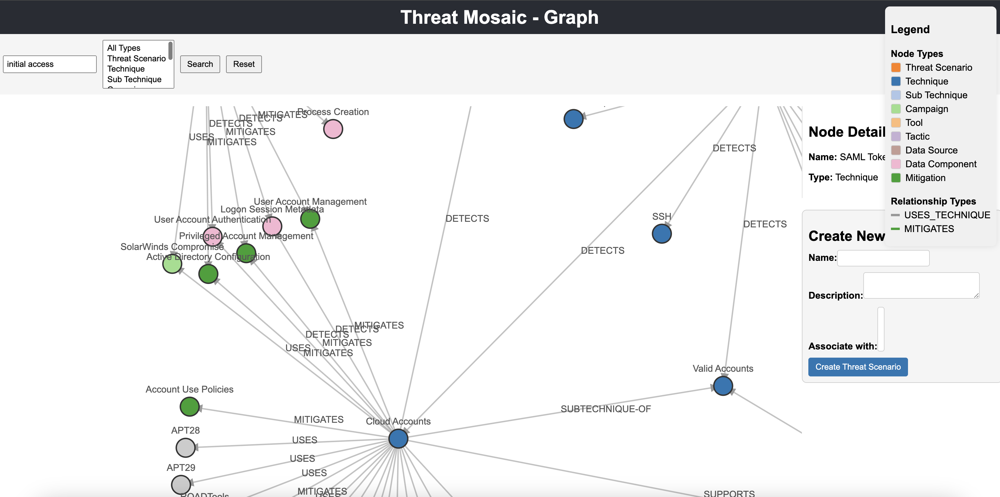

# Threat Detection Graph Application

Welcome to the **Threat Detection Graph Application** repository! This application is a powerful tool for visualizing and managing threat scenarios, techniques, and mitigations using an interactive graph interface. Built with **React**, **D3.js**, **Flask**, and **Neo4j**, it allows users to search, explore, and create new threat scenarios directly from the web interface.

---

## Table of Contents

- [Features](#features)
- [Demo](#demo)
- [Architecture](#architecture)
- [Prerequisites](#prerequisites)
- [Installation](#installation)
  - [1. Clone the Repository](#1-clone-the-repository)
  - [2. Set Up Environment Variables](#2-set-up-environment-variables)
  - [3. Build and Run Docker Containers](#3-build-and-run-docker-containers)
  - [4. Install Front-End Dependencies](#4-install-front-end-dependencies)
  - [5. Start the React Application](#5-start-the-react-application)
- [Usage](#usage)
  - [Access the Application](#access-the-application)
  - [Explore the Graph](#explore-the-graph)
  - [Search Nodes](#search-nodes)
  - [Create New Threat Scenarios](#create-new-threat-scenarios)
- [Project Structure](#project-structure)
- [API Documentation](#api-documentation)
  - [Base URL](#base-url)
  - [Endpoints](#endpoints)
    - [1. Get Threat Scenarios](#1-get-threat-scenarios)
    - [2. Search Nodes](#2-search-nodes)
    - [3. Create Threat Scenario](#3-create-threat-scenario)
- [Contributing](#contributing)
- [License](#license)
- [Contact](#contact)
- [Acknowledgments](#acknowledgments)
- [Additional Documentation](#additional-documentation)
  - [Setting Up the Neo4j Database](#setting-up-the-neo4j-database)
  - [API Development Notes](#api-development-notes)
  - [Deployment](#deployment)
  - [Frequently Asked Questions](#frequently-asked-questions)
- [Support](#support)

---

## Features

- **Interactive Graph Visualization**: Explore threat scenarios, techniques, and mitigations through an interactive graph powered by D3.js.
- **Search Functionality**: Quickly find nodes using the search bar.
- **Node Details**: View detailed information about nodes by clicking on them.
- **Create New Threat Scenarios**: Add new threat scenarios directly from the web interface.
- **Dynamic Updates**: The graph updates in real-time as new data is added.
- **Responsive Design**: The interface is optimized for various screen sizes.
- **Error Handling and Loading Indicators**: Provides feedback to users during data fetching and error situations.

---

## Demo



---

## Architecture

The application consists of three main components:

1. **Front-End**: Built with **React** and **D3.js**, it provides an interactive user interface for visualizing and interacting with the threat graph.
2. **Back-End API**: A **Flask** application that serves API endpoints for data retrieval and manipulation.
3. **Database**: **Neo4j** is used as the graph database to store nodes and relationships.

---

## Prerequisites

Before you begin, ensure you have the following installed on your system:

- **Docker** and **Docker Compose**: For containerized deployment.
- **Node.js** and **npm**: For running the React application.

---

## Installation

### 1. Clone the Repository

```bash
git clone https://github.com/yourusername/threat-detection-app.git
cd threat-detection-app
```
### 2. Set Up Environment Variables

Create a .env file in the project root directory and add any necessary environment variables. For example:

```bash
NEO4J_AUTH=neo4j/password
```
### 3. Build and Run Docker Containers

Use Docker Compose to build and start the back-end services:

```bash
docker-compose up -d --build
```
This will start the following services:

- Neo4j Database: Accessible at bolt://localhost:7687 and http://localhost:7474.
- Flask API: Accessible at http://localhost:5001.

### 4. Install Front-End Dependencies

Navigate to the frontend directory and install dependencies:

```bash
cd frontend
npm install
```
### 5. Start the React Application

Start the development server:

```bash
npm start
```
This will run the application at http://localhost:3000.

## Usage

### Access the Application

Open your web browser and navigate to http://localhost:3000.

### Explore the Graph

- Zoom and Pan: Use your mouse or trackpad to zoom in/out and pan around the graph.
- Click on Nodes: Click on any node to view detailed information in the sidebar.
- Drag Nodes: Click and drag nodes to rearrange them for better visibility.

### Search Nodes

- Enter a search term in the search bar at the top.
- Click Search to highlight matching nodes.
- Click Reset to return to the full graph view.

### Create New Threat Scenarios

- Scroll down to the Create New Threat Scenario form.
- Enter the name and description of the new threat scenario.
- Click Create Threat Scenario to add it to the graph.

## Project Structure

```
threat-detection-app/
├── backend/
│   ├── app.py
│   ├── requirements.txt
│   ├── import_stix.py
│   ├── Dockerfile
├── frontend/
│   ├── public/
│   ├── src/
│   │   ├── components/
│   │   │   ├── Graph.js
│   │   │   ├── NodeDetails.js
│   │   │   ├── SearchBar.js
│   │   │   └── NewThreatForm.js
│   │   ├── App.js
│   │   ├── index.js
│   │   └── styles.css
│   ├── package.json
│   └── Dockerfile
├── docker-compose.yml
└── README.md
```

## API Documentation

### Base URL

All API endpoints are accessed via http://localhost:5001/api/.

### Endpoints

1. Get Threat Scenarios

	•	Endpoint: GET /api/threat_scenarios
	•	Description: Retrieves all threat scenarios with associated techniques.
	•	Response:

```json
[
  {
    "id": "threat1",
    "name": "Threat Scenario 1",
    "description": "Description of threat scenario 1",
    "techniques": [
      {
        "id": "technique1",
        "name": "Technique 1",
        "description": "Description of technique 1",
        "external_id": "T1001"
      }
    ]
  }
  // More threat scenarios...
]
```

2. Search Nodes

	•	Endpoint: GET /api/search
	•	Query Parameters:
	•	query: The search term.
	•	Description: Searches for nodes whose name contains the query string.
	•	Response:

```json
[
  {
    "id": "node1",
    "name": "Node Name",
    "labels": ["Technique"]
  }
  // More nodes...
]
```

3. Create Threat Scenario

	•	Endpoint: POST /api/threat_scenarios
	•	Description: Creates a new threat scenario.
	•	Request Body:

```json
{
  "name": "New Threat Scenario",
  "description": "Description of the new threat scenario"
}
```
Response:

```json
{
  "id": "generated-id",
  "name": "New Threat Scenario",
  "description": "Description of the new threat scenario"
}
```
## Contributing

Contributions are welcome! Please follow these steps:

- Fork the Repository
- Create a Feature Branch

```bash
git checkout -b feature/your-feature-name
```

- Commit your Changes

  ```bash
  git commit -m "Add your message here"
  ```
  
- Push to Your Fork

```bash
git push origin feature/your-feature-name
```

- Create a Pull Request (PR)

## Acknowledgments

- React: https://reactjs.org/
- D3.js: https://d3js.org/
- Flask: https://flask.palletsprojects.com/
- Neo4j: https://neo4j.com/

## Additional Documentation

### Setting Up the Neo4j Database

The application uses a Neo4j database to store and manage graph data.

1. Accessing the Neo4j Browser

- Open your web browser and navigate to http://localhost:7474.
- Log in with the credentials specified in your .env file (default username is neo4j, and the password is password).

2. Importing Data

If you need to import initial data into the database:

- Place your STIX data file (e.g., enterprise-attack.json) in the backend directory.
- Run the import script:

```bash
docker-compose exec backend python import_stix.py
```
API Development Notes

	•	CORS Configuration: The Flask API has CORS enabled to allow cross-origin requests from the React application.
	•	Error Handling: API endpoints include basic error handling and return appropriate HTTP status codes.

Deployment

For production deployment, consider the following:

	•	Use a Production Web Server: Deploy the Flask API using a production server like Gunicorn or uWSGI.
	•	Secure Communication: Implement HTTPS using SSL certificates.
	•	Environment Variables: Use secure methods to manage environment variables and secrets.
	•	Scaling: Configure Docker Compose or Kubernetes for scalability.

Frequently Asked Questions

Q: I’m getting a CORS error when trying to access the API. How do I fix this?

A: Ensure that CORS is enabled in your Flask application by including CORS(app) after initializing your Flask app. Also, check that the proxy is correctly set up in your React application’s package.json.

Q: How do I add relationships between nodes?

A: Currently, the application allows creating new threat scenarios. To add relationships, you can extend the API and front-end forms to include functionality for connecting nodes.

Q: Can I import custom data into the graph?

A: Yes, you can modify the import_stix.py script to import custom STIX data or write new scripts to handle different data formats.

Support

If you encounter any issues or have questions, please open an issue on GitHub or reach out via email.

Thank you for using the Threat Detection Graph Application!
